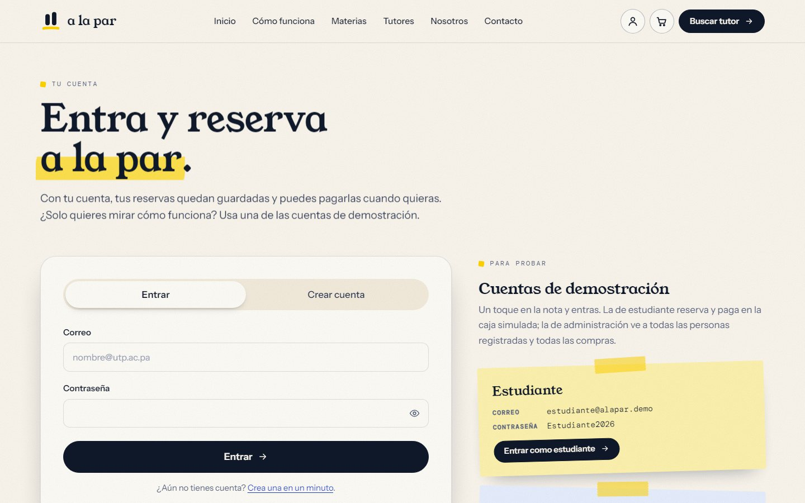
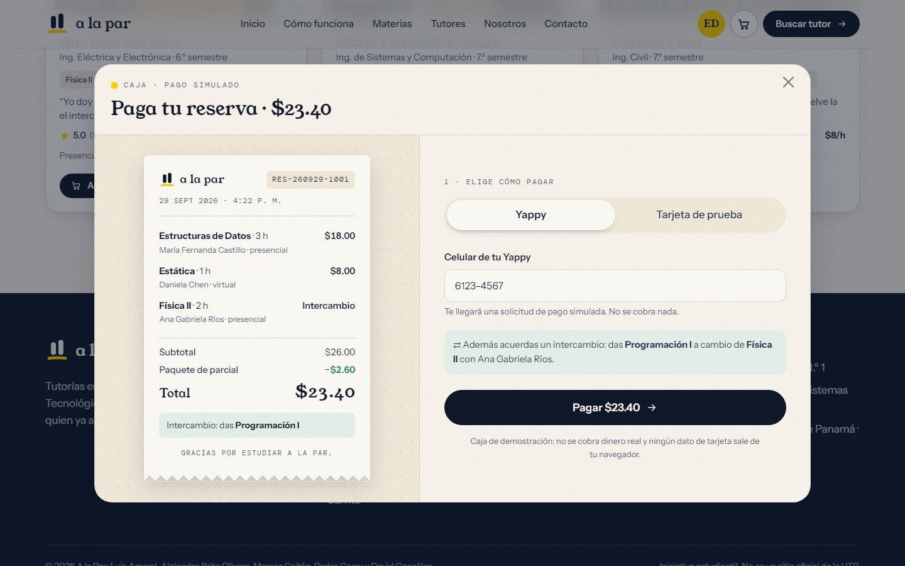
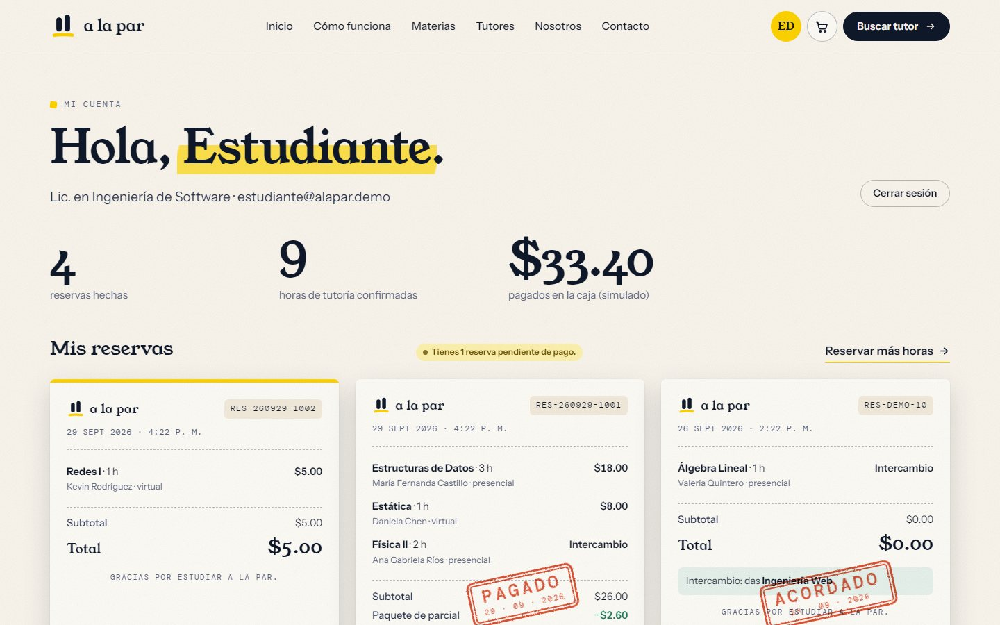
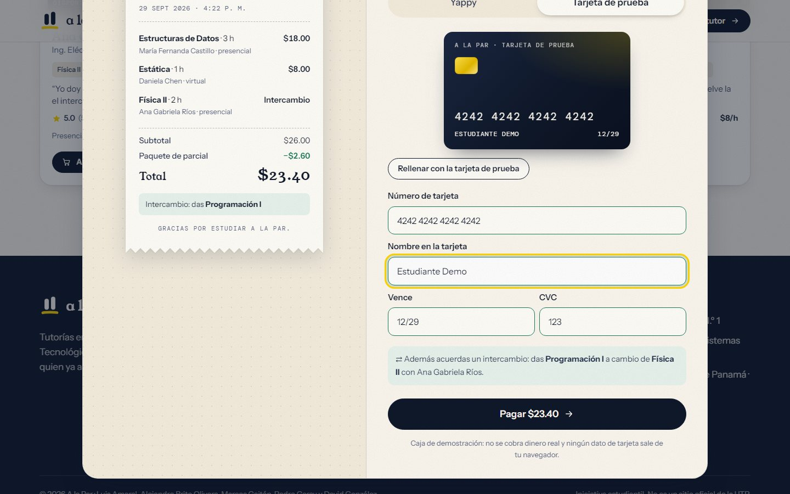
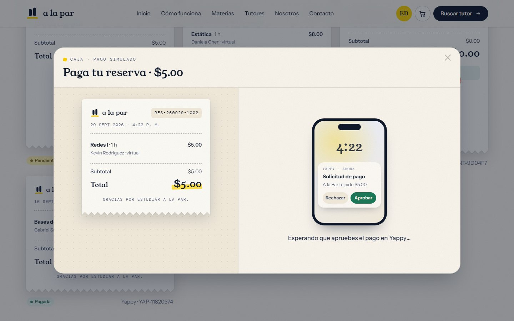
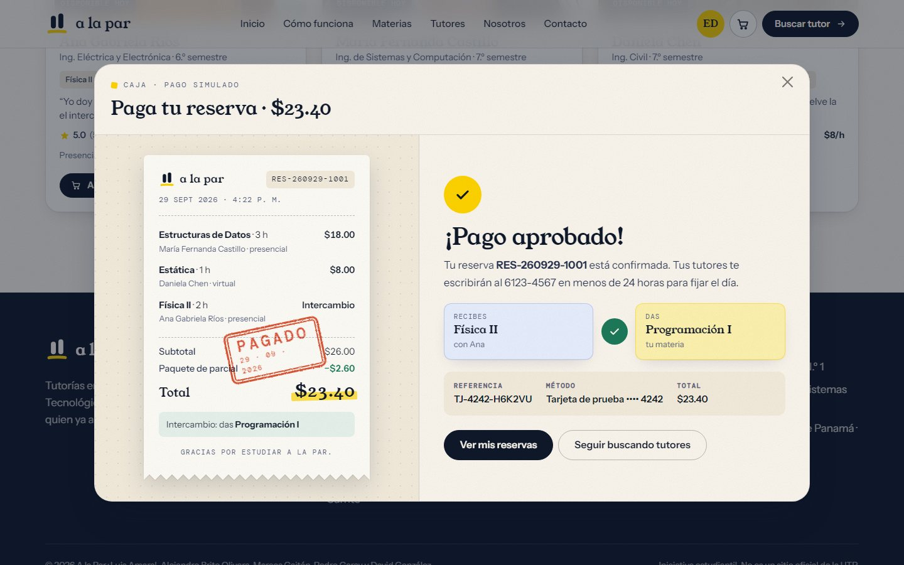
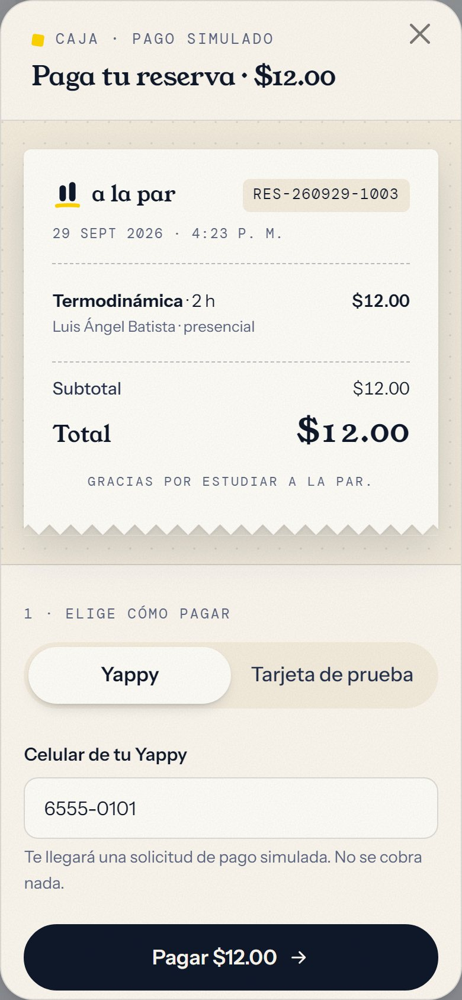
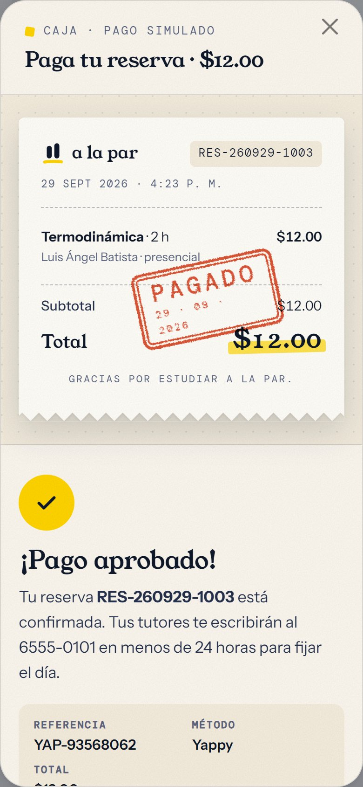
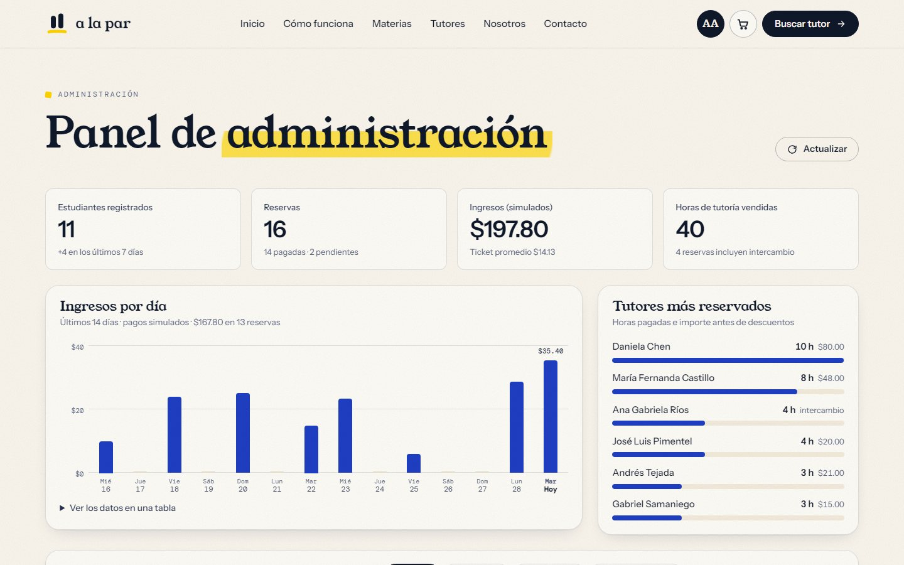
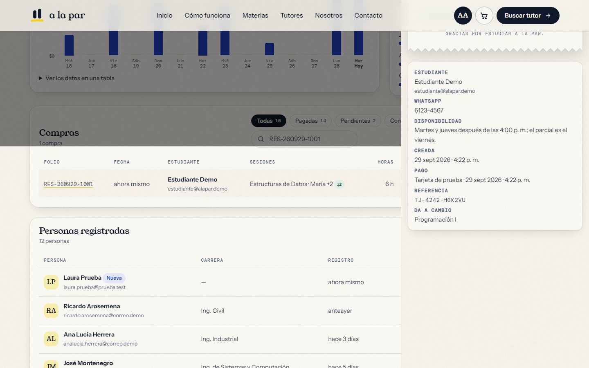

# A la Par — tutorías entre estudiantes de la UTP

**A la Par** conecta a quien necesita ayuda con una materia con estudiantes de la
Universidad Tecnológica de Panamá que ya la aprobaron, a menudo con el mismo
profesor. Las tutorías son presenciales o virtuales, cuestan entre $5 y $8 la hora
o se pagan por intercambio de materias, sin dinero de por medio.

**Sitio en vivo:** https://alapar-utp.vercel.app


Proyecto de **Ingeniería Web** (Licenciatura en Ingeniería de Software, Facultad de
Ingeniería de Sistemas Computacionales, UTP), grupo 1SF134. Facilitadora: Dra. Denis
Cedeño. Septiembre de 2026.

> **Versión 2.** El sitio ya no es solo estático: tiene **servidor y base de datos
> PostgreSQL**, **cuentas** con inicio de sesión, **cuentas de demostración** de
> estudiante y de administración, una **caja de pago simulado** (Yappy, tarjeta de
> prueba e intercambios) con su animación y un **panel de administración** con las
> personas registradas y todas las compras.

---

## Índice

1. [Pruébalo: cuentas de demostración](#pruébalo-cuentas-de-demostración)
2. [Qué hay en el sitio](#qué-hay-en-el-sitio)
3. [Cómo se reserva y se paga](#cómo-se-reserva-y-se-paga)
4. [La caja y su animación](#la-caja-y-su-animación)
5. [Panel de administración](#panel-de-administración)
6. [Arquitectura](#arquitectura)
7. [Base de datos](#base-de-datos)
8. [API](#api)
9. [Seguridad](#seguridad)
10. [El frontend por dentro](#el-frontend-por-dentro)
11. [Cómo ejecutarlo y publicarlo](#cómo-ejecutarlo-y-publicarlo)
12. [Cómo se probó](#cómo-se-probó)
13. [Equipo y créditos](#equipo)

---

## Pruébalo: cuentas de demostración

| Cuenta | Correo | Contraseña | Qué puede hacer |
| --- | --- | --- | --- |
| Estudiante | `estudiante@alapar.demo` | `Estudiante2026` | Reservar, pagar en la caja simulada y ver sus reservas |
| Administración | `admin@alapar.demo` | `Admin2026` | Todo lo anterior y el panel con personas registradas y compras |

En la página **Entrar** cada cuenta es una nota adhesiva: un toque y entras. También
puedes **crear tu propia cuenta**. Como la cuenta de administración de demostración es
pública, el formulario pide no usar un correo, una contraseña ni un teléfono reales.



## Qué hay en el sitio

| Página | Archivo | Qué se puede hacer |
| --- | --- | --- |
| Inicio | `index.html` | Portada con vídeo que avanza con el scroll, el problema, tres pasos, cifras, materias y tutores destacados, testimonios |
| Cómo funciona | `como-funciona.html` | El proceso paso a paso, requisitos para ser tutor, reglas y preguntas frecuentes |
| Materias | `materias.html` | Catálogo de 34 materias con filtros por facultad, búsqueda y orden |
| Tutores | `tutores.html` | Directorio de 9 tutores con filtros; cada tarjeta tiene **Al carrito** y **Preguntar** |
| Nosotros | `nosotros.html` | La necesidad, la propuesta, el equipo, la ficha técnica y la hoja de ruta |
| Contacto | `contacto.html` | Formulario con validación en vivo |
| Carrito | `carrito.html` | Revisar las horas, entrar con la cuenta, dejar los datos y pasar a la caja |
| Entrar | `entrar.html` | Iniciar sesión, crear cuenta o usar una cuenta de demostración |
| Mis reservas | `mi-cuenta.html` | Recibos de todas tus reservas, su estado y las que faltan por pagar |
| Administración | `admin.html` | Cifras, ingresos por día, tutores más reservados, compras y personas registradas |

## Cómo se reserva y se paga

**1. Eliges tutor, materia, modalidad y horas.** Cada tarjeta del directorio tiene
**Al carrito**, que abre una ventana con el importe calculado en vivo.


**2. El carrito se llena.** Mientras eliges, las horas viven en tu navegador y el panel
lateral enseña el descuento del paquete de parcial (10 % desde 4 horas pagadas).


**3. Entras con tu cuenta sin perder el carrito.** Si no has entrado, el carrito te lo
pide. Con **Probar con la cuenta demo** entras sin salir de la página. Luego dejas tu
WhatsApp y tu disponibilidad, y **Continuar al pago** guarda la reserva en la base de
datos a tu nombre.


**4. Pagas en la caja.** Con Yappy o con la tarjeta de prueba. Si la reserva incluye
horas por intercambio, la caja confirma también el intercambio. Si cierras sin pagar,
la reserva queda **pendiente** y puedes pagarla después desde **Mis reservas**.



**5. Mis reservas.** Cada reserva es un recibo con su sello: *Pagado*, *Acordado* (solo
intercambio) o una franja amarilla si falta pagarla.



## La caja y su animación

La caja es una coreografía corta que cuenta lo que pasa, no un adorno.

| Momento | Qué se ve |
| --- | --- |
| Se abre | El recibo sale «de la impresora»: se revela de arriba abajo y las líneas llegan una tras otra. |
| Tarjeta de prueba | Una tarjeta dibujada se rellena mientras escribes y **se voltea en 3D** al pedir el CVC. Al pagar, un brillo la recorre mientras el banco «autoriza». |
| Yappy | Aparece un teléfono, llega la notificación «A la Par te pide $X» y un toque la aprueba. |
| Pagado | El total se **subraya con marcador**, cae un **sello de goma «PAGADO»** con textura de tinta, el recibo acusa el golpe y saltan trazos de marcador como confeti. |
| Intercambio | Las fichas **Das** y **Recibes** se cruzan en arco, cambian de lugar y el símbolo ⇄ se convierte en ✓. |

<table>
  <tr>
    <td></td>
    <td></td>
  </tr>
</table>



Cómo está hecha:

- **Web Animations API** (`js/caja.js`, clase `Coreografia`), animando solo `transform`,
  `opacity` y `clip-path`, que el navegador mueve sin recalcular la página.
- Curvas de salida (*ease-out*) para lo que entra. Solo la barra de progreso, que es un
  movimiento continuo, usa una curva lineal.
- **Se puede saltar:** un clic durante la animación la lleva al final.
- **Respeta «reducir movimiento»:** con esa preferencia del sistema, todo va directo al
  estado final (el pago completo tarda unos 60 ms).
- Mientras se procesa el pago la caja no se puede cerrar. Una región `aria-live`
  anuncia «Procesando el pago…» y «Pago aprobado» a los lectores de pantalla.

<table>
  <tr>
    <td></td>
    <td></td>
  </tr>
</table>

**Nada se cobra de verdad.** La caja solo acepta la tarjeta de prueba
`4242 4242 4242 4242`: cualquier otro número se rechaza en el navegador y en el
servidor, y del navegador solo sale el final `4242`. Los campos de tarjeta desactivan
el autocompletado, para que el navegador no ofrezca tarjetas guardadas.

## Panel de administración

Solo lo ve una cuenta con rol `admin` (el servidor lo comprueba en cada petición).

- **Cifras:** estudiantes (y cuántos en los últimos 7 días), reservas pagadas y
  pendientes, ingresos simulados con ticket promedio, horas vendidas.
- **Ingresos por día:** columnas de los últimos 14 días. Cada columna se puede enfocar
  con el teclado y muestra su importe y el número de reservas. Los mismos datos están en
  una tabla desplegable.
- **Tutores más reservados:** horas pagadas e importe antes de descuentos.
- **Compras:** búsqueda por folio, estudiante o tutor y filtros *Todas / Pagadas /
  Pendientes / Con intercambio*. Al elegir una compra se abre su recibo con los datos de
  contacto, la disponibilidad y la referencia del pago.
- **Personas registradas:** búsqueda por nombre, correo o carrera, con la insignia
  *Nueva* para las cuentas de las últimas 24 horas.
- Se actualiza solo al volver a la pestaña; al recargar, lo anterior se queda visible y
  atenuado, sin saltos.





## Arquitectura

```
Navegador (HTML5 + CSS3 + Bootstrap 5.3 + JavaScript con clases)
   │   fetch /api/…   cookie de sesión HttpOnly
   ▼
Funciones de Vercel (Node.js, carpeta api/)
   │   consultas SQL parametrizadas
   ▼
PostgreSQL · Neon en producción · PGlite (Postgres en WebAssembly) en local
```

- **Sin framework en el navegador.** Las páginas se generan una vez con `build.mjs` a
  partir de parciales (cabecera, pie, scripts) y se sirven como archivos estáticos.
- **Funciones sin estado** en `api/`, una por recurso. La conexión a la base es el
  controlador HTTP de Neon (`@neondatabase/serverless`), pensado para funciones que
  arrancan y se apagan.
- **La base se prepara sola.** La primera petición de cada instancia comprueba la
  versión del esquema: si la base está vacía, crea las tablas y siembra los datos de
  demostración (con sentencias idempotentes). El catálogo de materias y tutores se
  sincroniza en cada arranque con `js/datos.js`, que sigue siendo la única fuente de
  verdad: `build.mjs` genera a partir de él `api/_lib/catalogo.js`.
- **En local no hace falta instalar Postgres:** el servidor de desarrollo usa PGlite,
  un Postgres real compilado a WebAssembly, y el código de producción no cambia.

## Base de datos

| Tabla | Qué guarda |
| --- | --- |
| `usuarios` | nombre, correo (único sin distinguir mayúsculas), contraseña con scrypt, rol (`estudiante` / `admin`), carrera, alta y último acceso |
| `sesiones` | huella SHA-256 del token de la cookie, usuario y vencimiento (7 días) |
| `materias` | código, nombre y área (sincronizado con `js/datos.js`) |
| `tutores` | tarifa por hora (0 = intercambio), modalidades y materias que da |
| `reservas` | folio (`RES-AAMMDD-NNNN`, de una secuencia), usuario, estado (`pendiente` / `pagada`), WhatsApp, disponibilidad, materia a cambio, horas, subtotal, descuento, total, método y referencia del pago |
| `reserva_lineas` | cada sesión de la reserva: tutor, materia, modalidad, horas y tarifa congelada |
| `esquema` | versión de las migraciones aplicadas |

Una reserva y sus sesiones se guardan en **una sola sentencia** (CTE con
`jsonb_to_recordset`): o se guarda todo o nada.

Los datos de demostración son 2 cuentas para entrar, 9 estudiantes ficticios y 14
reservas repartidas en las últimas dos semanas (pagadas con Yappy, con tarjeta, por
intercambio y alguna pendiente), para que el panel no arranque vacío.

## API

| Método | Ruta | Sesión | Qué hace |
| --- | --- | --- | --- |
| `GET` | `/api/auth/yo` | — | Quién ha entrado (`null` si nadie) |
| `POST` | `/api/auth/entrar` | — | `{ correo, clave }` → abre sesión |
| `POST` | `/api/auth/registro` | — | `{ nombre, correo, clave, carrera? }` → crea una cuenta de estudiante y abre sesión |
| `POST` | `/api/auth/salir` | sí | Cierra la sesión |
| `GET` | `/api/reservas` | sí | Las reservas de la cuenta, con sus sesiones |
| `POST` | `/api/reservas` | sí | `{ lineas, telefono, disponibilidad, ofrece? }` → reserva pendiente; los importes los calcula el servidor |
| `POST` | `/api/reservas/pagar` | sí | `{ folio, metodo, telefono \| ultimos4 }` → pago simulado o confirmación del intercambio |
| `GET` | `/api/admin/resumen` | admin | Cifras, serie de 14 días, personas, compras y tutores |

Los errores vuelven siempre como JSON `{ error, mensaje, detalles? }`, y `detalles`
señala campo por campo qué falló, para marcarlo en el formulario.

## Seguridad

- **Contraseñas con scrypt**, con sal aleatoria y comparación en tiempo constante. Si
  el correo no existe se verifica igual contra un hash señuelo, para que la respuesta no
  delate qué cuentas están registradas.
- **Sesiones** con un token aleatorio de 256 bits en una cookie `HttpOnly`,
  `SameSite=Lax` y `Secure`. En la base solo se guarda su huella SHA-256.
- **CSRF:** toda petición que cambia datos debe ser JSON y venir del mismo origen.
- **El servidor no se fía del navegador:** recalcula tarifas, descuento y total con la
  base de datos, comprueba que cada tutor dé esa materia y modalidad, ignora el `rol`
  que llegue en el registro y solo deja pagar las reservas propias.
- **SQL siempre parametrizado.** Nunca se pega texto del usuario dentro de una consulta.
- **Todo lo que escriben las personas se escapa** antes de pintarlo (los nombres del
  panel, por ejemplo).
- **Redirecciones solo a páginas propias:** después de entrar, `?siguiente=` acepta una
  lista cerrada.
- **Sin datos de tarjeta:** solo la tarjeta de prueba, y del navegador solo sale `4242`.
- Pendiente para una versión real: limitar los intentos de inicio de sesión y verificar
  el correo al registrarse.

## El frontend por dentro

Los scripts se cargan en este orden y cada uno solo usa los anteriores:

```
datos → modelos → ui → validacion → sesion → carrito → caja → admin → paginas
```

| Archivo | Clases |
| --- | --- |
| `js/datos.js` | Materias, tutores, testimonios y preguntas |
| `js/modelos.js` | `Materia`, `Tutor`, `Catalogo` → `CatalogoMaterias`, `CatalogoTutores`, `Repositorio` |
| `js/ui.js` | `Navegacion`, `Revelador`, `ContadorAnimado`, `HeroScrollVideo`, `Aviso`, `Plantillas` |
| `js/validacion.js` | `ReglaValidacion`, `Validador`, `CampoFormulario`, `Solicitud`, `FormularioContacto` |
| `js/sesion.js` | `ErrorApi`, `ClienteApi` (fetch a la API), `Sesion` (quién ha entrado, observable), `VistaSesion` (menú de la cuenta) |
| `js/carrito.js` | `ArticuloCarrito`, `Carrito` (observable, en `localStorage`), `Reserva`, `ModalReserva`, `VistaCarrito`, `FormularioReserva` |
| `js/caja.js` | `Recibo`, `Coreografia`, `TarjetaPrueba`, `Caja` |
| `js/admin.js` | `GraficoDias`, `RankingTutores`, `TablaPersonas`, `TablaCompras`, `DetalleCompra`, `PanelAdmin` |
| `js/paginas.js` | `Pagina` → una clase por página, incluidas `PaginaEntrar`, `PaginaCuenta` y `PaginaAdmin`; `App` arranca la que toca |

Ideas que se repiten:

- **Encapsulamiento:** el estado va en campos privados (`#lineas`, `#usuario`…).
- **Patrón observador:** `Carrito` y `Sesion` avisan de cada cambio. La cabecera, el
  panel lateral y los formularios se repintan solos.
- **Herencia:** las páginas heredan de `Pagina`, y los catálogos de `Catalogo`.
- **Validación en dos lados:** en el navegador para responder rápido, en el servidor
  porque es el que manda.

## Cómo ejecutarlo y publicarlo

**En local** (Node.js 20 o superior):

```bash
npm install
npm run dev          # http://localhost:5183 con una base PGlite en desarrollo/.pglite
```

Para trabajar contra una base Neon, crea `.env.local` con
`DATABASE_URL=postgresql://…`. Ese archivo no se sube nunca: está en `.gitignore`.

**Para cambiar una página:** edita `src/pages/<página>.html` o un parcial de
`src/partials/` y ejecuta `npm run paginas`.

**En Vercel:** conecta una base **Neon** al proyecto (pestaña *Storage* → *Neon*, que
crea la variable `DATABASE_URL`) y despliega. No hace falta ejecutar migraciones: la
primera petición crea las tablas y los datos de demostración.

## Cómo se probó

Dos baterías automáticas, cada una con su propia base en memoria:

- **`npm run prueba:api`** (41 comprobaciones): sesiones y cookies, contraseñas
  equivocadas, peticiones de otro origen y que no son JSON, precios manipulados desde el
  navegador, materias o modalidades que un tutor no da, más de 8 horas, teléfonos
  inválidos, pagar la reserva de otra persona, pagar dos veces, tarjetas que no son la
  de prueba, intercambios, registro duplicado, rol inyectado y el panel de
  administración.
- **`npm run prueba:sitio`** (49 comprobaciones, Playwright): el recorrido completo en
  Chromium. Carrito, entrar sin perderlo, caja con tarjeta y con Yappy, reserva
  pendiente pagada después, crear una cuenta, panel de administración (filtros,
  búsqueda, detalle, gráfico), un estudiante bloqueado en el panel y la caja en un
  teléfono. Además comprueba que no haya errores de JavaScript y que las páginas no se
  desborden en el móvil.

```bash
npm run prueba       # las dos
npm run capturas     # regenera las capturas de este README
```

## Equipo


| Integrante | Área en el proyecto |
| --- | --- |
| Luis Amaral | Carrito de reservas: reglas de precio, descuento por paquete y flujo de confirmación |
| Alejandro Brito Olivera | Identidad visual, arquitectura del sitio y desarrollo front-end con POO en JavaScript |
| Marcos Gaitán | Investigación de la necesidad y contenidos del catálogo de materias y tutores |
| Pedro Garay | Diseño responsive y pruebas en teléfonos, tabletas y navegadores |
| David González | Validación de formularios, documentación y publicación en Vercel y GitHub |

Los cinco cursan Ingeniería de Software en la Universidad Tecnológica de Panamá.

## Créditos

- Fotografías y vídeo generados con IA (Flux 2, Soul 2 y Kling 3) a partir de
  indicaciones escritas por el equipo. Los tutores, testimonios, estudiantes y
  compras de demostración son ficticios.
- Tipografías: Young Serif, Instrument Sans y DM Mono (Google Fonts, licencia SIL Open
  Font).
- Bootstrap 5.3 (MIT), `@neondatabase/serverless` (MIT), PGlite (Apache 2.0 / PostgreSQL)
  y Playwright (Apache 2.0).

A la Par es una iniciativa estudiantil y un proyecto de curso: no es un servicio
oficial de la UTP, y la caja no procesa pagos reales.
