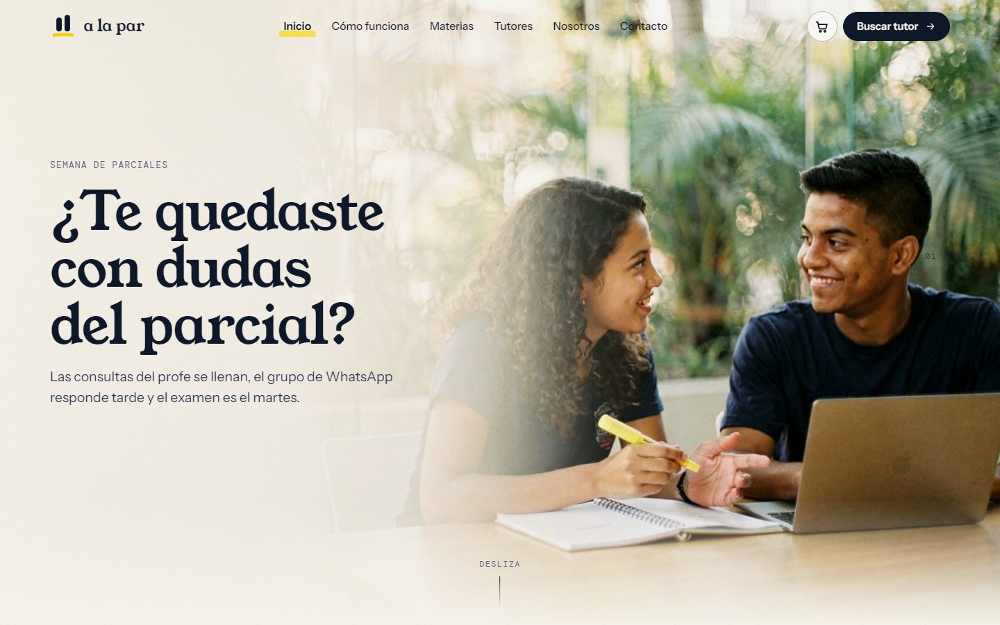
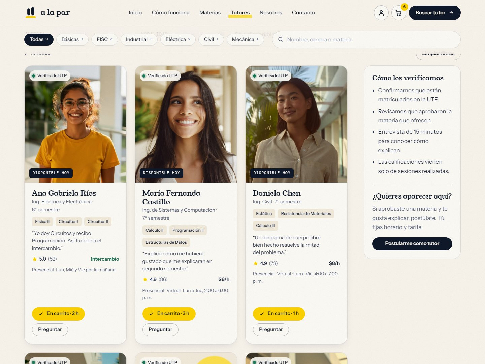
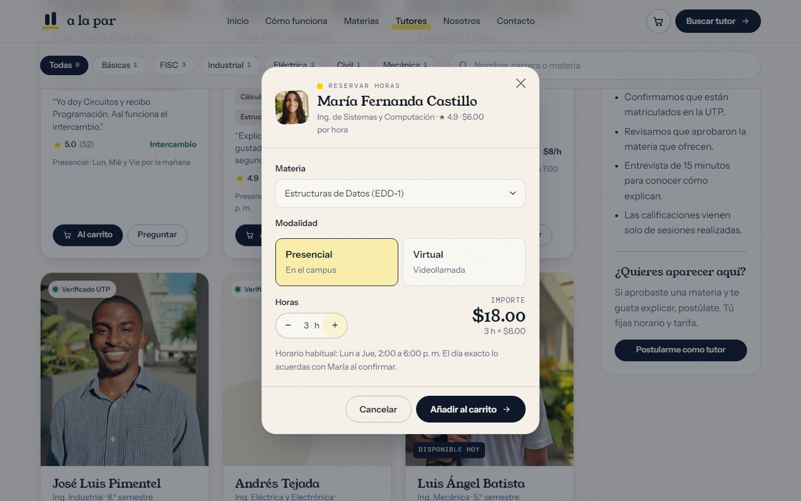
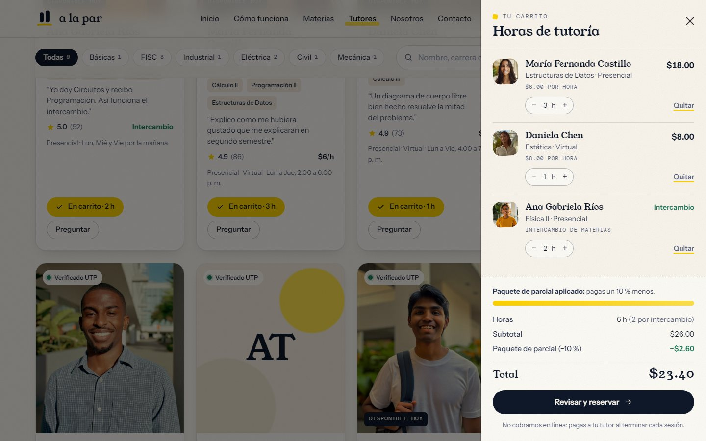
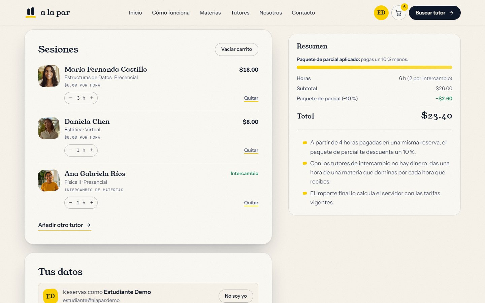
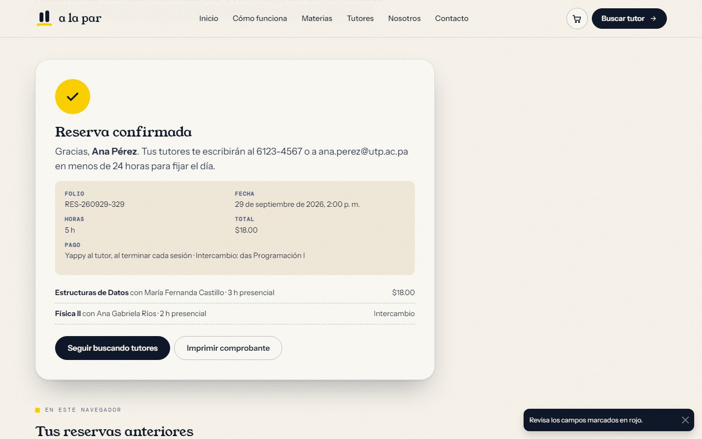
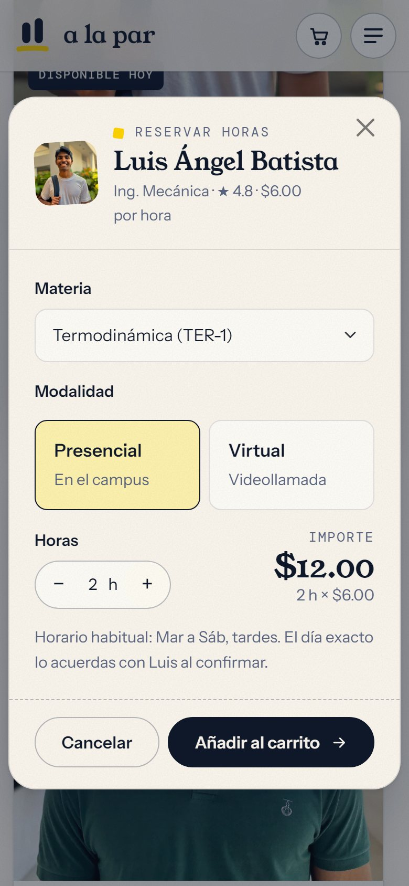
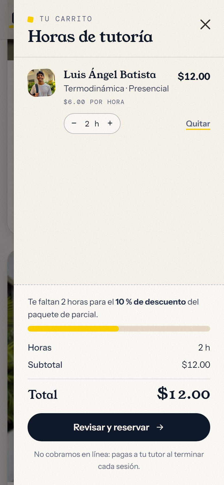
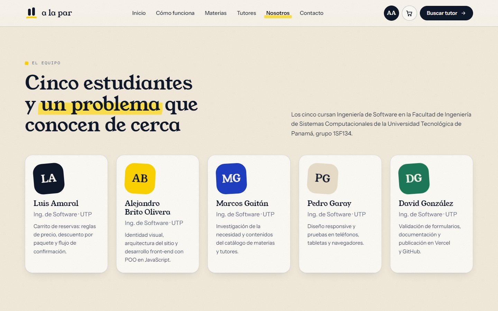

# A la Par — tutorías entre estudiantes de la UTP

**A la Par** conecta a quien necesita ayuda con una materia con estudiantes de la
Universidad Tecnológica de Panamá que ya la aprobaron, a menudo con el mismo
profesor. Las tutorías son presenciales o virtuales, cuestan entre $5 y $8 la hora
o se pagan por intercambio de materias, sin dinero de por medio.

**Sitio en vivo:** https://alapar-utp.vercel.app



Proyecto N.º 1 de **Ingeniería Web** (Licenciatura en Ingeniería de Software,
Facultad de Ingeniería de Sistemas Computacionales, UTP), grupo 1SF134.
Facilitadora: Dra. Denis Cedeño. Septiembre de 2026.

---

## Índice

1. [La necesidad](#la-necesidad)
2. [Qué hay en el sitio](#qué-hay-en-el-sitio)
3. [El carrito de reservas](#el-carrito-de-reservas)
4. [Cómo está hecho](#cómo-está-hecho)
5. [Estructura del proyecto](#estructura-del-proyecto)
6. [Cómo verlo y modificarlo](#cómo-verlo-y-modificarlo)
7. [Cómo se probó](#cómo-se-probó)
8. [Equipo y créditos](#equipo)

---

## La necesidad

En las materias básicas de ingeniería muchos estudiantes llegan al parcial con
dudas acumuladas. Las horas de consulta del profesor no alcanzan para grupos
grandes, los grupos de WhatsApp responden tarde y las academias particulares
cobran tarifas pensadas para otro bolsillo. En el mismo campus, dos mesas más
allá, hay alguien que aprobó esa materia el semestre pasado y sabe exactamente
dónde se atoró.

A la Par pone en contacto a esas dos personas: eliges materia y tutor, reservas
las horas y estudias.

## Qué hay en el sitio

| Página | Archivo | Qué se puede hacer |
| --- | --- | --- |
| Inicio | `index.html` | Portada con vídeo que avanza con el scroll, el problema, tres pasos, cifras animadas, materias y tutores destacados, testimonios |
| Cómo funciona | `como-funciona.html` | El proceso paso a paso, requisitos para ser tutor, reglas de la comunidad y preguntas frecuentes |
| Materias | `materias.html` | Catálogo de 34 materias con filtros por facultad, búsqueda y orden |
| Tutores | `tutores.html` | Directorio de 9 tutores con filtros por facultad, materia, modalidad y disponibilidad. Cada tarjeta tiene **Al carrito** y **Preguntar** |
| Nosotros | `nosotros.html` | La necesidad, la propuesta de valor, el equipo, la ficha técnica y la hoja de ruta |
| Contacto | `contacto.html` | Formulario con validación en vivo para preguntar, pedir una materia o postularse como tutor |
| Carrito | `carrito.html` | Revisar las horas elegidas, dejar los datos y la forma de pago, y confirmar la reserva |

## El carrito de reservas

En A la Par no se compran objetos: se compran **horas de tutoría**. Cada línea del
carrito es «N horas de *materia* con *tutor*, presencial o virtual».

### 1. Elegir tutor

En el directorio, o entre los destacados de la portada, cada tutor tiene el botón
**Al carrito**. Si ya tienes horas con esa persona, el botón se pinta de marcador
y dice cuántas.



### 2. Materia, modalidad y horas

El botón abre una ventana con las materias que da ese tutor, las modalidades que
ofrece y un contador de horas de 1 a 8. El importe se calcula en vivo con su
tarifa. Si el directorio está filtrado por una materia, esa ya viene elegida.



### 3. El panel lateral

Al añadir, se abre el panel del carrito. Desde ahí se suben o bajan horas, se
quitan líneas y se ve el resumen. El botón de la cabecera muestra cuántas horas
llevas y rebota cada vez que añades algo.



### 4. Revisar y confirmar

`carrito.html` junta las sesiones, el formulario y el resumen. El formulario
solo pide lo necesario:

- nombre, correo y WhatsApp (para que el tutor fije el día);
- **forma de pago**: Yappy o efectivo. Solo aparece si hay horas pagadas;
- **materia que das a cambio**. Solo aparece si hay horas por intercambio;
- disponibilidad y la casilla de aceptación.



### 5. Reserva confirmada

Al confirmar se genera un folio (`RES-AAMMDD-NNN`), se muestra el comprobante (se
puede imprimir), el carrito se vacía y la reserva pasa al historial de ese
navegador.



### En el teléfono

<table>
  <tr>
    <td></td>
    <td></td>
  </tr>
</table>

### Las reglas del carrito

| Regla | Cómo funciona |
| --- | --- |
| Precio | Tarifa del tutor × horas. La tarifa se lee siempre del catálogo, nunca de lo guardado en el navegador, así que no se puede manipular desde `localStorage`. |
| Líneas iguales | Mismo tutor + misma materia + misma modalidad = una sola línea: las horas se suman. |
| Límites | De 1 a 8 horas por línea. |
| Paquete de parcial | Desde 4 horas pagadas en una misma reserva, 10 % de descuento. Una barra de marcador enseña cuánto falta. |
| Intercambio | Los tutores con precio 0 no cobran: das una hora de una materia que dominas por cada hora que recibes. |
| Pago | El sitio no cobra en línea ni pide datos de tarjeta: se paga al tutor al terminar cada sesión. |
| Persistencia | El carrito se guarda en `localStorage` (`alapar:carrito`) y se sincroniza entre pestañas abiertas. Las reservas se guardan en `alapar:reservas`. |
| Vaciar | Pide un segundo toque, sin ventanas del navegador. |

Todavía no hay base de datos: el Proyecto 1 del curso es un sitio sin servidor.
En el Proyecto 2 la reserva se enviará a una base de datos MySQL en lugar de
quedarse en el navegador.

## Cómo está hecho

### Tecnologías

- **HTML5 semántico**: `header`, `nav`, `main`, `section`, `article`, `aside`,
  `footer`, `figure`, `address`, `time`, `mark`, `output`, `fieldset`/`legend`.
- **CSS3** propio sobre **Bootstrap 5.3** (copia local en `vendor/`): variables,
  `grid`, `clamp()`, `aspect-ratio`, `position: sticky`, animaciones,
  `prefers-reduced-motion` y transiciones entre páginas.
- **JavaScript ES2022 orientado a objetos**, sin frameworks: clases, herencia,
  campos y métodos privados (`#`), getters y métodos estáticos.
- **Responsive**: probado en 375, 390, 768, 1024, 1280 y 1440 px de ancho.
- **Hosting**: Vercel, plan gratuito.

### Capas de JavaScript

Los archivos se cargan en este orden y cada uno solo usa los anteriores:

```
datos.js  →  modelos.js  →  ui.js  →  validacion.js  →  carrito.js  →  paginas.js
 (datos)     (dominio)     (interfaz)   (formularios)     (carrito)     (arranque)
```

| Archivo | Clases | Para qué |
| --- | --- | --- |
| `js/datos.js` | — | Materias, tutores, testimonios y preguntas. En el Proyecto 2 vendrán de la base de datos. |
| `js/modelos.js` | `Materia`, `Tutor`, `Testimonio`, `Pregunta`, `Catalogo` → `CatalogoMaterias`, `CatalogoTutores`; `Repositorio` | El modelo del negocio. `Catalogo` es una colección genérica e inmutable (filtrar, ordenar, buscar, agrupar) de la que heredan los catálogos concretos. |
| `js/ui.js` | `Navegacion`, `Revelador`, `ContadorAnimado`, `HeroScrollVideo`, `Marquesina`, `Aviso`, `Plantillas` | Lo que se ve: animaciones al hacer scroll, el vídeo de la portada, avisos y el HTML de tarjetas y listas. |
| `js/validacion.js` | `ReglaValidacion`, `Validador`, `CampoFormulario`, `Solicitud`, `AlmacenSolicitudes`, `FormularioContacto` | Validación campo a campo, reutilizable por cualquier formulario del sitio. |
| `js/carrito.js` | `Dinero`, `AlmacenLocal`, `ArticuloCarrito`, `Carrito`, `Reserva` (hereda de `Solicitud`), `PlantillasCarrito`, `ModalReserva`, `VistaCarrito`, `FormularioReserva`, `Tienda` | Todo el carrito: reglas de precio, persistencia, ventana de reserva, panel lateral y confirmación. |
| `js/paginas.js` | `Pagina` → `PaginaInicio`, `PaginaMaterias`, `PaginaTutores`, `PaginaComoFunciona`, `PaginaNosotros`, `PaginaContacto`, `PaginaCarrito`; `App` | Un controlador por página. `App` arranca el que corresponde según `<body data-pagina>`. |

### Ideas de diseño del código

- **Encapsulamiento.** El estado vive en campos privados (`#lineas`, `#horas`…).
  Nadie fuera de `Carrito` puede tocar sus líneas sin pasar por `agregar()`,
  `cambiarHoras()`, `quitar()` o `vaciar()`, que validan, guardan y avisan.
- **Observador.** `Carrito.suscribir(fn)` avisa de cada cambio. El botón de la
  cabecera, el panel lateral, la página del carrito y el formulario se repintan
  solos: ninguno llama a otro.
- **Herencia.** `Reserva extends Solicitud` reutiliza el folio y la fecha del
  formulario de contacto; solo cambia el prefijo (`RES` en vez de `AP`) y congela
  las sesiones y los importes en el momento de confirmar.
- **Una sola fuente de verdad.** Precios y nombres salen del `Repositorio`. Una
  línea guardada que ya no existe en el catálogo se descarta al cargar.
- **Accesibilidad.** Los cambios del carrito se anuncian en una región viva para
  lectores de pantalla, el foco vuelve al mismo botón tras repintar, todo se
  puede usar con teclado y el movimiento se apaga con «reducir movimiento».

### Identidad visual

Cuaderno y marcador: papel `#fbf7ef`, tinta `#10192b` y marcador amarillo
`#ffd400`, con Young Serif para los títulos, Instrument Sans para el texto y
DM Mono para las etiquetas. Los `<mark>` se pintan al entrar en pantalla y el
carrito usa el mismo lenguaje: el contador es un punto de marcador, el descuento
es un trazo que se llena y el resumen se corta como un recibo.

### Páginas generadas desde parciales

La cabecera, el pie y los scripts están escritos una sola vez en `src/partials/`.
Cada página de `src/pages/` contiene solo su `<main>`, y `node build.mjs` las
une y escribe los `.html` finales en la raíz, marcando el enlace activo del menú.
En el Proyecto 2 esos parciales se convierten directamente en `include` de PHP.

## Estructura del proyecto

```
alapar/
├── index.html, como-funciona.html, materias.html, tutores.html,
│   nosotros.html, contacto.html, carrito.html   ← el sitio (generado)
├── css/estilos.css        tokens, componentes, animaciones y carrito
├── js/                    datos, modelos, interfaz, validación, carrito y páginas
├── vendor/bootstrap/      Bootstrap 5.3.8 (CSS y JS)
├── assets/img/            fotografías (WebP), logo, favicon, imagen para compartir
├── assets/video/          vídeo de la portada (escritorio y móvil)
├── src/                   fuente de las páginas: partials/ y pages/
├── build.mjs              genera los .html de la raíz a partir de src/
├── pruebas/               prueba de extremo a extremo con Playwright
├── docs/capturas/         las capturas de este README
└── vercel.json            URLs limpias y caché en el hosting
```

El ZIP que se entregó por Teams lleva solo el sitio (y las capturas); `src/`,
`build.mjs` y `pruebas/` están en este repositorio.

## Cómo verlo y modificarlo

- **En línea:** https://alapar-utp.vercel.app
- **En local, sin instalar nada:** abre `index.html` con doble clic.
- **Con un servidor local:**

  ```bash
  npx http-server . -p 5183 -c-1
  ```

- **Para cambiar una página:** edita `src/pages/<página>.html` (o un parcial de
  `src/partials/`) y regenera:

  ```bash
  node build.mjs
  ```

  Los `.html` de la raíz no se editan a mano: `build.mjs` los sobrescribe.

## Cómo se probó

`pruebas/carrito.e2e.mjs` recorre el sitio en Chromium como lo haría una persona
y hace 46 comprobaciones:

- añadir horas con tres tutores, incluida una de intercambio, y que el importe,
  el descuento y el total cuadren en cada paso;
- subir, bajar y quitar horas desde el panel, sin perder el foco del teclado;
- recargar la página y que el carrito siga ahí;
- enviar el formulario vacío y que marque cada campo obligatorio, y rechazar un
  teléfono que no es de Panamá;
- confirmar, obtener un folio `RES-…`, ver el historial y comprobar lo guardado
  en `localStorage`;
- vaciar con doble toque, el equipo de cinco personas en *Nosotros* y en el pie,
  el formulario de contacto de siempre y la vista de teléfono sin desplazamiento
  horizontal;
- ningún error de JavaScript en la consola.

```bash
npm install                 # instala Playwright (solo para las pruebas)
npm run servir              # en una terminal
npm run prueba              # en otra
```

## Equipo



| Integrante | Área en el proyecto |
| --- | --- |
| Luis Amaral | Carrito de reservas: reglas de precio, descuento por paquete y flujo de confirmación |
| Alejandro Brito Olivera | Identidad visual, arquitectura del sitio y desarrollo front-end con POO en JavaScript |
| Marcos Gaitán | Investigación de la necesidad y contenidos del catálogo de materias y tutores |
| Pedro Garay | Diseño responsive y pruebas en teléfonos, tabletas y navegadores |
| David González | Validación de formularios, documentación y publicación en Vercel y GitHub |

Los cinco cursan Ingeniería de Software en la Universidad Tecnológica de Panamá.

## Créditos

- Fotografías y vídeo generados con IA (Flux 2, Soul 2 y Kling 3) a partir de
  indicaciones escritas por el equipo. Los tutores, testimonios y cifras son
  ficticios.
- Tipografías: Young Serif, Instrument Sans y DM Mono (Google Fonts, licencia
  SIL Open Font).
- Bootstrap 5.3 (licencia MIT).

A la Par es una iniciativa estudiantil y un proyecto de curso: no es un servicio
oficial de la UTP.
